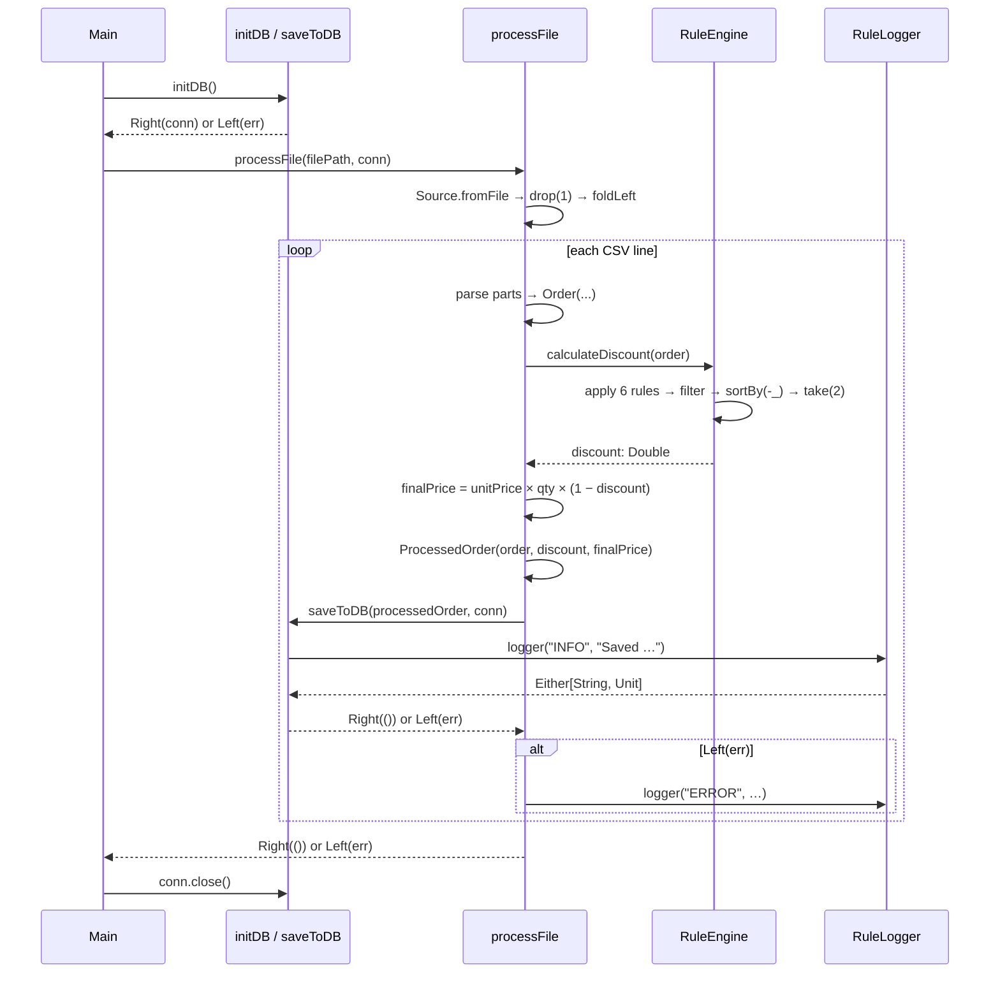
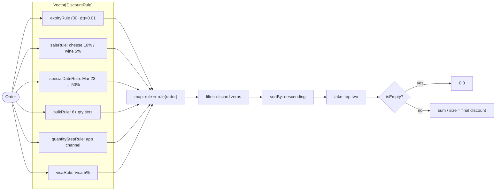

# Functional-Retail-Pipeline-Scala
A flexible, extensible Scala discount calculation pipeline for commercial orders.

A rule-based discount engine for a retail store, built in **pure functional Scala**. The engine reads transaction CSV data, evaluates each order against a set of discount rules, calculates the final price, and persists results to a SQLite database — all while logging every event to a file.


## Functional Programming Constraints

The entire codebase respects the following FP constraints:

| Constraint | How it's enforced |
|---|---|
| No `var` | Only `val` used throughout |
| No mutable data structures | `Vector` for rules, case classes for data |
| No loops | `foldLeft` / `foreach` / `map` / `filter` replaces all iteration |
| Pure functions | `RuleEngine` has zero side effects |
| Total functions | Every function returns a value for every possible input |
| Error handling | `Either[String, Unit]` via `.toEither.left.map(_.getMessage)` |

---

## Architecture — Separation of Concerns

The project is split into 4 logical layers:

```
src/main/scala/retail/
├── dataModel.scala     → Data models (Order, ProcessedOrder)
├── ruleEngine.scala    → Pure discount rules
├── ruleLogger.scala    → File logging side effect
└── Main.scala          → DB, file I/O, execution trigger
```

Each layer has a single responsibility. Adding a new rule never touches `Main.scala`. Adding a new field never touches `RuleEngine`.

---

## End-to-End Execution Sequence

The following sequence diagram illustrates the complete execution flow from initialization through order processing to completion:



**Key Points:**
- **Main** orchestrates the entire workflow, starting with database initialization
- **initDB / saveToDB** handles all SQLite operations with `Either` error handling
- **processFile** reads the CSV line-by-line using functional iteration (foldLeft)
- **RuleEngine** is pure — it takes an Order and returns a discount without side effects
- The discount calculation applies all 6 rules, filters positive values, sorts descending, and averages the top 2
- **RuleLogger** is the only component that performs I/O (writing to the log file)
- All error paths use `Either[String, Unit]` for functional error handling

---

## Data Models

```scala
case class Order(
  transactionDate: LocalDate,
  productName: String,
  expiryDate: LocalDate,
  unitPrice: Double,
  quantity: Int,
  channel: String,
  paymentMethod: String
)

case class ProcessedOrder(
  order: Order,
  discount: Double,
  finalPrice: Double,
  processedAt: LocalDateTime = LocalDateTime.now()
)
```

---

## Rule Engine Design

### The Core Type Alias

```
DiscountRule ≡ Order → ℝ
```

A discount rule is a pure function from the `Order` algebraic data type to the real numbers (representing discount as a decimal). This type alias is the backbone of the entire engine — it enables **composition** and **aggregation** of rules without modification to the core calculation logic.

**Category Theory Lens:** Each rule is a morphism in the category where objects are types and morphisms are pure functions. The type constructor `Order → ℝ` is an exponential object in the Cartesian closed category of Scala types.

### The Rules Pool

```
rules: Vector[DiscountRule] = [expiryRule, saleRule, specialDateRule, bulkRule, quantityStepRule, visaRule]
```

The rules are accumulated in an immutable `Vector` — a persistent, functional sequence with O(1) append amortized complexity. This enables:
- **Open/Closed Principle**: Extend by adding to the Vector, never modify existing code
- **Referential transparency**: Each rule is a pure, composable value
- **Type safety**: The compiler guarantees all rules conform to `Order → ℝ`

### Discount Calculation Logic

```
calculateDiscount(order: Order): ℝ =
  let applied = rules ∘ (λr. r(order))          // apply every rule
      qualified = filter(> 0, applied)         // keep only qualifying ones
      sorted = sort(descending, qualified)    // sort descending
      top2 = take(2, sorted)                  // extract top 2
  in
      if top2 = ∅ then 0                      // identity element
      else sum(top2) / |top2|                 // average
```

**Functional Composition:** This is a pipeline of higher-order functions:
- `map` (∘): distributes the order across all rules
- `filter`: predicates on the discount semiring
- `sortBy`: orders by the total order on ℝ
- `take`: extracts a fixed-size prefix
- Pattern matching: handles the empty vs non-empty cases algebraically

### Key Logic
- If **no rule** qualifies → 0% discount.
- If **one rule** qualifies → that discount applies directly.
- If **multiple rules** qualify → take the **top 2** and **average** them.

### Rule Engine Flow

The following flowchart visualizes the discount calculation pipeline from order input through rule application to final discount:



**Flow Explanation:**
- **Order** enters the system and is distributed to all 6 rules in parallel
- Each rule in the **Vector[DiscountRule]** independently calculates its discount
- **map** applies each rule function to the order, producing a collection of discounts
- **filter** removes zero-valued discounts (rules that didn't qualify)
- **sortBy** orders the remaining discounts in descending order
- **take** extracts only the top 2 highest discounts
- **isEmpty?** checks if any rules qualified
- If no rules qualified, returns **0.0** (identity element)
- Otherwise, calculates the **average** of the top 2 discounts as the final result

---

## All Discount Rules

### 1. Expiry Rule: Linear Decay Function

**Functional Thinking Process:** Map temporal proximity to expiry to a linear discount gradient.

**Equation:**

```
d(expiry, transaction) = 
   0                                         if Δt ≥ 30 or Δt ≤ 0
  (30 - Δt) × 0.01                           otherwise
```
where **Δt = days between transaction and expiry**


| Days Remaining | Discount |
|---|---|
| 29 days | 1% |
| 28 days | 2% |
| 27 days | 3% |
| ... | ... |
| 1 day | 29% |

### 2. Sale Rule: String Pattern Matching

**Functional Thinking Process:** Predicate-based classification via substring containment.

**Equation:**

```
d(productName) = 
  0.10  if "cheese" ∈ productName (case-insensitive)
  0.05  if "wine" ∈ productName (case-insensitive)
  0.00  otherwise
```

| Product | Discount |
|---|---|
| Cheese | 10% |
| Wine | 5% |

### 3. Special Date Rule: Temporal Predicate

**Functional Thinking Process:** A constant function conditioned on a specific temporal predicate.

**Equation:**

```
d(date) = 
  0.50  if month = 3 ∧ day = 23
  0.00  otherwise
```


March 23rd → **50% discount** on all products.

### 4. Bulk Rule: Piecewise Function on ℕ

**Functional Thinking Process:** Quantization of integer quantity into discount tiers via pattern matching.

**Equation:**

```
d(quantity) = 
  0.10  if q ≥ 15
  0.07  if 10 ≤ q < 15
  0.05  if 6 ≤ q < 10
  0.00  otherwise
```

| Quantity | Discount |
|---|---|
| 6–9 units | 5% |
| 10–14 units | 7% |
| 15+ units | 10% |

### 5. App Quantity Step Rule: Continuous Discretization

**Functional Thinking Process:** Map unbounded integer domain to bounded discrete tiers via ceiling division.

**NEW Business requirement:** Encourage App usage by rewarding quantity-based purchases made through the App channel.

**Equation:**

```
d(q, channel) = 
  0.00                          if channel ≠ "app"
  min(⌈q/5⌉, 20) × 0.05     otherwise
```

**Functional Derivation:**
- The division `q/5` converts integer quantity to a continuous ratio
- `⌈·⌉` (ceiling) discretizes to integer tiers
- `min(·, 20)` bounds the output to prevent exceeding 100%
- Multiplication by 0.05 converts tier to *percentage* discount


**Why the cap at 20?** Tier 20 × 5% = 100% so the maximum possible discount. Beyond this, discounts are meaningless.


| Quantity | `⌈q/5⌉` | `min(...,20)` | Discount |
|---|---|---|---|
| 3 | 1 | 1 | 5% |
| 7 | 2 | 2 | 10% |
| 12 | 3 | 3 | 15% |
| 100 | 20 | 20 | 100% (capped) |

### 6. Visa Rule: Predicate Constant

**Functional Thinking Process:** A constant function guarded by an equality predicate on the payment method.

**NEW Business requirement:** Promote paperless payments by giving a minor discount to Visa card users.

**Equation:**
```
d(paymentMethod) = 
  0.05  if paymentMethod = "visa" (case-insensitive)
  0.00  otherwise
```

Flat **5% discount** for all Visa transactions.

---

## Worked Example: Multi-Rule Interaction

**Order:** channel = `"App"`, quantity = `7`, paymentMethod = `"Visa"`, transactionDate = `March 23rd`

| Rule | Fires? | Value |
|---|---|---|
| `expiryRule` | depends on expiry date | — |
| `saleRule` | No | 0% |
| `specialDateRule` | Yes (March 23rd) | 50% |
| `bulkRule` | Yes (6–9 units) | 5% |  
| `quantityStepRule` | Yes (App, qty=7) | 10% |
| `visaRule` | Yes (Visa) | 5% |

After sorting descending: `[0.50, 0.10, 0.07, 0.05]`

Top 2: `0.50` and `0.10`

**Final discount:** `(0.50 + 0.10) / 2 = 0.30` → **30%**


---

## Error Handling: Either[String, Unit]

All I/O operations use `Either` for functional error handling:

```scala
Try { ... }.toEither.left.map(_.getMessage)
```

- `Right(())` → success
- `Left(errorMessage)` → failure with descriptive string

This pattern is used consistently in `logger`, `saveToDB`, `initDB`, and `processFile`, making every failure path explicit and type-safe with no unsafe `.get` calls anywhere.

---

## Database

SQLite via `org.xerial:sqlite-jdbc`. The table is created on first run:

```sql
CREATE TABLE IF NOT EXISTS processed_orders (
  timestamp    TEXT,
  product_name TEXT,
  discount     REAL,
  final_price  REAL
)
```

---

## Testing

### Database Query Tool

A query tool is provided to inspect the processed orders in the SQLite database:

**File:** `src/main/scala/query_db.scala`

**Usage:**
```bash
# Query first 10 records (default)
scala run src/main/scala/query_db.scala

# Query first N records
scala run src/main/scala/query_db.scala 50

# Execute custom SQL query
scala run src/main/scala/query_db.scala "SELECT * FROM processed_orders WHERE discount > 0.1"
```

**Features:**
- Accepts either a numeric limit or a full SQL query
- Automatically formats output with aligned columns
- Handles NULL values gracefully
- Includes error handling for invalid queries

### Unit Tests

**File:** `src/test/scala/RuleEngineSpec.scala`

Pure function unit tests for the discount rules using munit:

```bash
scala test src/test/scala/RuleEngineSpec.scala
```

The test suite verifies:
- Individual rule calculations (expiry, sale, special date, bulk, quantity step, visa)
- Top-2 averaging logic for multiple qualifying rules
- Edge cases (no rules qualify, single rule, multiple rules)
- Boundary conditions (exactly at thresholds)

---

## To Run The Project

Run the main application:
```bash
scala run src/main/scala/retail/*.scala --main-class retail.Main
```

Run the unit tests:
```bash
scala test src/test/scala/RuleEngineSpec.scala src/main/scala/retail/*.scala
```

## Design Principles Applied

**Open/Closed Principle** — The engine is open for extension (add new `val` rules) but closed for modification (never touch `calculateDiscount` or `processFile` to add a rule).

**Pure Core, Impure Shell** — `RuleEngine` is 100% pure with no side effects. All I/O (logging, DB, file reading) lives in `Main` and is clearly marked as impure.


**Pluggable Rule Pool** — `type DiscountRule = Order => Double` means any new business rule is just a new function. The `Vector` accumulates them. The averaging logic is universal.